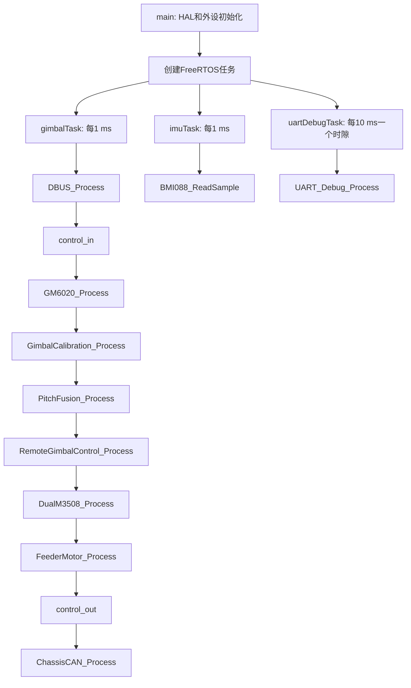

# STM32F407 云台工程新手代码导读

这份文件是源码的“阅读地图”。它不替代代码注释，而是先回答三个问题：

1. 单片机上电后按什么顺序运行；
2. 一个遥控器动作如何最终变成 CAN 电流；
3. 代码中常见的变量名、类型和状态分别表示什么。

## 1. 先建立整体画面

本工程控制的对象有四类：

- Yaw / Pitch 两个 GM6020 云台电机；
- 两个 C620/M3508 摩擦轮；
- 一个 C610/M2006 拨弹盘；
- 一个通过 CAN1 接收底盘运动命令的底盘控制器。

主要输入和输出如下：

| 方向 | 硬件 | 代码模块 | 作用 |
| --- | --- | --- | --- |
| 输入 | DBUS / USART3 + DMA | `dbus.c` | 读取遥控器摇杆、拨杆、拨轮 |
| 输入 | USB CDC | `control_input.c`、`USB_DEVICE/App/usbd_cdc_if.c` | 接收 ASCII 角度、急停和标定查询命令 |
| 输入 | BMI088 / SPI1 | `bmi088.c` | 读取加速度和陀螺仪 |
| 输入 | CAN1 / CAN2 | `motor_control.c` 等 | 读取各电机反馈 |
| 输出 | CAN1 / CAN2 | 各控制模块 | 发送电流、底盘速度和模式 |
| 输出 | USART6 + DMA | `uart_debug.c` | 输出给电脑观察的调试文本 |
| 输出 | USB CDC | `control_input.c` | `control_out()`向MiniPC/上位机回传机器人基础状态 |

## 2. 上电和任务启动流程

### 2.1 `main()` 做什么

`Core/Src/main.c` 中的 `main()` 只负责“搭台子”，不负责长期控制：

1. `HAL_Init()`：初始化 STM32 HAL；
2. `SystemClock_Config()`：把系统时钟配置到 168 MHz；
3. `MX_*_Init()`：初始化 GPIO、SPI、DMA、CAN 和 UART；
4. 初始化项目模块：GM6020、标定、摩擦轮、拨弹盘、底盘、DBUS、BMI088、Pitch 融合和调试串口；
5. `osKernelInitialize()`、`MX_FREERTOS_Init()`、`osKernelStart()`：启动 FreeRTOS。

`osKernelStart()` 成功后，程序通常不会再回到 `main()` 里的 `while (1)`；后续逻辑由 `Core/Src/freertos.c` 的任务执行。

### 2.2 三个任务



`gimbalTask` 的调用顺序很重要：

```text
DBUS_Process()
    -> 解析本周期刚收到的遥控器帧
control_in()
    -> 处理 USB 命令并设置目标/急停
GM6020_Process()
    -> 读取云台 CAN 反馈，运行串级 PID，准备电流
GimbalCalibration_Process()
    -> 上电静止采样和 Pitch 自动回零
PitchFusion_Process()
    -> 更新 BMI088 + 编码器融合结果
RemoteGimbalControl_Process()
    -> 把摇杆映射成云台、底盘、摩擦轮、拨弹盘请求
DualM3508_Process()
    -> 处理 CAN2 FIFO1 的两台摩擦轮
FeederMotor_Process()
    -> 处理 CAN1 FIFO1 的拨弹盘
control_out()
    -> 通过Micro-USB CDC周期回传状态，作为后续视觉协议输出入口
ChassisCAN_Process()
    -> 每10 ms发送底盘的0x300/0x301
等待下一个1 ms周期
```

### 2.3 为什么要有两个 1 ms 任务

- `gimbalTask` 负责控制；它必须优先完成 CAN 反馈处理和电机输出。
- `imuTask` 负责阻塞式 SPI 读取 BMI088；它的优先级低于云台控制，避免 SPI 等待拖慢电机控制。
- BMI088 的最新数据由 `bmi088.c` 写入，融合器和调试任务读取。这个工程用 `sample_sequence` 做序列锁，避免读到一半更新的“撕裂数据”。

## 3. 从摇杆到电机电流

以 CH0 控制 Yaw 为例：

```text
DBUS帧
  -> DBUS_Process() 解包 CH0 为 centered_channel[0]
  -> normalize_channel() 去掉±30死区，得到 -1.0~+1.0
  -> 乘方向和最大角速度，得到角速度命令(deg/s)
  -> RemoteGimbalControl_Process() 对角速度积分，得到累计角度目标(deg)
  -> GM6020_SetMultiTurnTargetPosition() 换算成编码器计数目标
  -> GM6020_Process() 计算角度环，输出目标转速(rpm)
  -> GM6020_Process() 计算速度环，输出电流(raw)
  -> 组装CAN 0x1FE，发送到对应总线
  -> GM6020 电调驱动电机
```

Pitch 的输入链路类似，但它可以把 `PitchFusion_GetControlFeedback()` 返回的惯性角度和角速度交给 PID；融合失效时回退到 GM6020 编码器角度和电机反馈转速。

## 4. GM6020 串级 PID 怎么读

`Core/Src/motor_control.c` 中每个轴都有一份 `GM6020_Controller_t`。控制计算可以简化为：

```text
位置误差 = 目标多圈编码器位置 - 当前多圈编码器位置
角度环输出 = 角度PID(位置误差) + 目标速度前馈
速度误差 = 角度环输出的目标rpm - 电机反馈rpm
速度环输出 = 速度PID(速度误差) + 模型电流前馈
最终输出 = 限幅后的电流命令
```

外环输出是“目标 rpm”，内环输出是“电流 raw”。两个 PID 都有：

- `kp`：比例增益，当前误差越大，输出越大；
- `ki`：积分增益，消除长期静差；
- `kd`：微分增益，反映误差变化趋势；
- `integral`：积分累加值；
- `previous_error`：上一拍误差，用来算微分；
- `output`：最近一次计算结果。

代码中的 anti-windup 意味着：输出已经饱和、误差还在推动同一方向时，不再继续增加积分；如果误差反向，允许积分退回。

## 5. CAN 反馈和电流帧

### 5.1 GM6020

- 反馈标准帧 `0x206`，DLC=8；
- `DATA[0:1]`：编码器角度，0~8191；
- `DATA[2:3]`：电机转速 rpm；
- `DATA[4:5]`：实际转矩电流；
- `DATA[6]`：温度；
- 电流命令标准帧 `0x1FE`，ID2 使用 `DATA[2:3]`。

Yaw 和 Pitch 的 ID 都是 2，但它们在不同物理 CAN 总线上，所以代码通过“总线 + ID”区分轴：CAN1 是 Yaw，CAN2 是 Pitch。

### 5.2 FIFO 和过滤器

STM32F407 的 bxCAN 过滤器组由 CAN1/CAN2 共享：

- CAN1 常用 bank 0~13；
- CAN2 常用 bank 14~27；
- GM6020 Pitch 使用 bank 14，进入 FIFO0；
- CAN2 摩擦轮使用 bank 15，进入 FIFO1；
- CAN1 Yaw 使用 FIFO0，拨弹盘 `0x203` 使用 FIFO1。

所以不同模块不能随意修改 `FilterBank`、`SlaveStartFilterBank` 或 FIFO；否则一个模块可能把另一个模块的反馈取走。

## 6. 上电标定和 Pitch 融合

### 6.1 云台标定

`gimbal_calibration.c` 为每个轴单独维护状态：

```text
WAITING_FEEDBACK -> WAITING_STILL -> SAMPLING -> CALIBRATED
                                      |
                                      +-> ERROR
Pitch: CALIBRATED 前可能先经过 RETURNING_ZERO
```

Yaw 的静止采样主要用于确认反馈稳定，逻辑零位来自配置的 `YAW_SENSOR_ZERO_ECD`。

Pitch 同时采集编码器和 BMI088 重力角，根据：

```text
编码器相对零位的角度 = BMI088重力角 × 编码器方向
```

计算 Pitch 零点。标定完成后，Pitch 以受限速度慢慢回到传感器定义的 0°，到达并稳定一段时间后才允许遥控器接管。

### 6.2 Pitch 二维 Kalman

`pitch_fusion.c` 的状态只有两个量：

```text
x[0] = 惯性Pitch角度(deg)
x[1] = 陀螺零偏(deg/s)
```

每次新 IMU 样本到来时：

1. 从原始加速度计算重力角；
2. 从原始陀螺计算角速度；
3. 减去陀螺零偏；
4. 用陀螺角速度积分预测角度；
5. 只有加速度模长接近 1 g 且新息不过大时，才使用重力角修正；
6. 数据失效时进入 `PITCH_FUSION_DEGRADED`，重新对齐并等待健康样本后恢复；
7. 输出给控制器前，再限制融合角度和角速度相对编码器的最大偏差。

注意：`fused_pitch_deg` 是融合器的估计值，`encoder_pitch_deg` 是电机相对安装架的机械角；二者参考系不同，不能简单地每拍强行相等。

## 7. 其他执行机构

### 7.1 双摩擦轮 `dual_m3508.c`

两台电机必须同时在线。状态大致为：

```text
DISABLED -> WAIT_FEEDBACK -> RAMPING -> READY
     |             |             |
     +---------- ESTOP / FAULT <-+
```

ID2 的物理方向与 ID1 相反，代码用 `motor_directions[]` 把反馈和命令统一成“逻辑正转=发射方向”。任一电机反馈超时、过温或堵转，两个电机同时归零并锁存故障。

### 7.2 拨弹盘 `feeder_motor.c`

连续发射和退弹是速度控制；单发是“位置外环 + 速度内环”：

```text
拨轮边沿
  -> 计算下一发的多圈编码器目标
  -> 位置误差换算成目标rpm
  -> 速度PID换算成电流
  -> 到位且低速保持一段时间
  -> HOLDING_SINGLE，只允许小的正向保持力
```

单发目标使用放大后的定点量保存小数步距，避免每发四舍五入造成累计漂移；如果向前超调超过窗口，不反向找位，而是进入故障。

## 8. 变量名速查

| 写法 | 含义 |
| --- | --- |
| `hcan1` / `hcan2` | HAL 的 CAN 外设句柄，`h` 常表示 handle |
| `huart3` / `huart6` | HAL 的 UART 外设句柄 |
| `static` | 只在当前 `.c` 文件可见的私有变量/函数 |
| `const` | 本函数中只读，不应被修改 |
| `volatile` | 可能被中断或硬件异步修改，编译器每次都要重新读取 |
| `*_raw` | 电机/传感器原始整数单位，例如电流 raw、ADC/IMU raw |
| `*_ecd` | encoder count，编码器计数 |
| `*_rpm` | revolutions per minute，转每分钟 |
| `*_dps` | degrees per second，度每秒 |
| `*_deg` | 角度，单位度 |
| `*_ms` | 时间，单位毫秒 |
| `*_valid` | 数据或目标是否有效 |
| `*_online` | 最近是否收到该设备反馈 |
| `*_initialized` | 是否已经完成首次初始化/首次数据建立 |
| `*_requested` | 上层请求的目标，不一定已经执行 |
| `*_target` | 控制器当前要追踪的目标 |
| `*_feedback` | 传感器或电机测得的实际值 |
| `*_command` | 即将发送给下一级或电调的命令 |
| `*_latched` | 锁存状态，必须显式清除，不会自动恢复 |
| `*_timing` | 是否正在计时某个“持续满足条件”的窗口 |
| `debug` | 给调试串口/上位机看的状态快照，不等于控制输入 |
| `context` | 一个模块的全部运行时私有状态 |

## 9. 建议的阅读顺序

第一次阅读不要从 `Drivers` 或 FreeRTOS 原库开始，按下面顺序更容易建立因果关系：

1. `README.md` 和本文件：了解硬件和协议；
2. `Core/Src/main.c`：确认初始化顺序；
3. `Core/Src/freertos.c`：确认周期任务和调用顺序；
4. `Core/Inc/motor_control.h`：先看类型和对外函数；
5. `Core/Src/motor_control.c`：看反馈、状态机、PID、CAN 输出；
6. `Core/Src/dbus.c` + `remote_gimbal_control.c`：看遥控器如何变成目标；
7. `gimbal_calibration.c` + `pitch_fusion.c`：看上电安全和 Pitch 反馈来源；
8. `dual_m3508.c`、`feeder_motor.c`、`chassis_can.c`：看其他执行机构；
9. `uart_debug.c`：最后看如何把内部变量格式化输出。

阅读任意函数时，先问四件事：

- 输入从哪里来；
- 输出写到了哪个结构体或 CAN 帧；
- 哪些条件会直接 `return`；
- 这个变量是“请求值、目标值、反馈值，还是实际发送值”。

最后要区分两种证据：能编译只能证明语法、类型和链接关系正确；电机真的转、方向正确、反馈在线，还需要实际烧录、供电、CAN 接线和急停条件下的台架验证。
